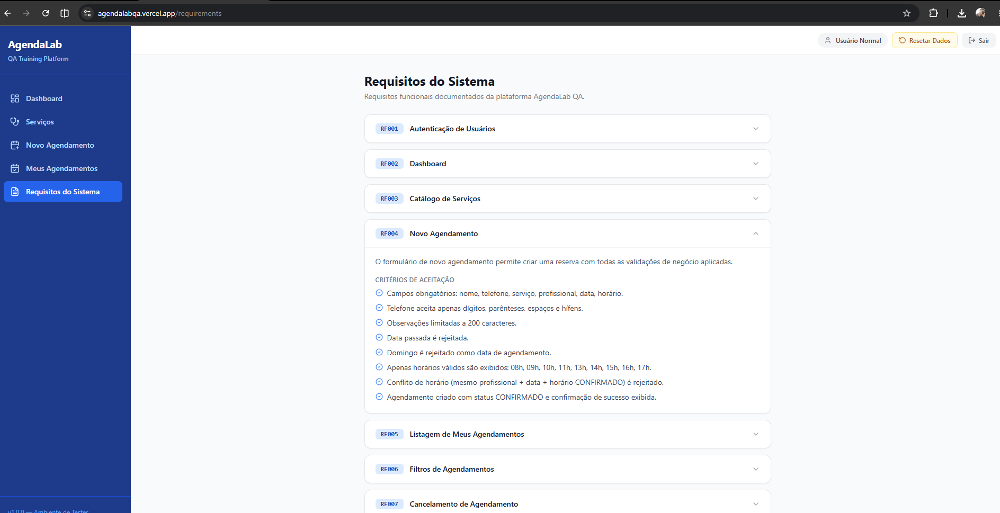

📋 Relatório de Validação e Testes Manuais - AgendaLab

# Analista de Qualidade: Talison Vieira Brito
Ambiente: https://agendalabqa.vercel.app/ - Data: 24/06/2026
 
🎯 Objetivo

Validar o correto funcionamento do fluxo de Novo Agendamento na plataforma AgendaLab, garantindo a conformidade com as regras de negócio estabelecidas e mitigando riscos antes do lançamento em produção.

🧠 O que é BDD?

O BDD (Behavior-Driven Development) é uma prática de desenvolvimento de software que visa integrar as regras de negócio com a especificação técnica e os testes. Ele utiliza uma linguagem natural, simples e estruturada para descrever como o sistema deve se comportar do ponto de vista do usuário final.

🔑 Massa de Teste

Usuário: usuario_normal
Senha: secret123

📑 Requisitos do Sistema

🧪 Cenários de Teste (CT)

👤 Campo: Nome

CT-01: Validar campos obrigatórios do formulário de agendamento

Dado que o usuário está na tela de agendamento
Quando ele tenta confirmar o agendamento deixando os campos "Nome", "Telefone", "Serviço", “Profissional”, "Data" e “Horário” vazios
Então o sistema deve exibir as respectivas mensagens de erro informando que os campos são obrigatórios
E o agendamento não deve ser processado
Evidência: [ct-01.png](evidencias/ct-01.png)
Resultado esperado: O sistema deve impedir o envio do formulário, destacar todos os campos obrigatórios ausentes e exibir as respectivas mensagens de alerta.
Resultado obtido: O formulário foi totalmente bloqueado e o sistema exibiu corretamente os alertas de obrigatoriedade para os campos Nome, Telefone, Serviço e Data, impedindo o processamento do agendamento.
Status: 🟢 Aprovado

---
CT-02: Validar campo Nome aceitando apenas letras e espaço (exceto primeiro caractere)

Dado que o usuário está na tela de agendamento
Quando ele insere no campo "Nome" números, caracteres especiais (#$%) e inicia com espaço
Então campo não deve aceitar a digitação dos mesmos
Evidência: [ct-02.png](evidencias/ct-02.png) , [ct-02-1.png](evidencias/ct-02-1.png)
Resultado esperado: O campo deve rejeitar caracteres inválidos (números/símbolos) e impedir espaços em branco no início da entrada.
Resultado obtido: O sistema permitiu a inserção de caracteres numéricos, especiais e espaço no início do campo e a confirmação do agendamento mesmo com o campo contendo esses caracteres.
Status: 🔴 Reprovado

---
📞 Campo: Telefone

CT-03: Validar campo Telefone aceitando apenas números e caracteres da máscara

Dado que o usuário está digitando no campo "Telefone"
Quando ele digita letras ou caracteres especiais (fora os caracteres da máscara)
Então o campo deve ignorar esses caracteres, mantendo apenas os números
Evidência: [ct-04.gif](evidencias/ct-04.gif)
Resultado esperado: A entrada de texto deve ser restrita a dígitos numéricos, formatando automaticamente o texto de acordo com a máscara telefônica estabelecida.
Resultado obtido: A máscara falhou em restringir a entrada, permitindo a digitação livre de caracteres alfabéticos e símbolos especiais.
Status: 🔴 Reprovado

---
🩺 Campos: Serviço e Profissional

CT-04: Validar bloqueio e liberação do campo Profissional

Dado que o usuário acabou de acessar a tela de agendamento
Então o campo "Profissional" deve estar desabilitado para seleção
Quando o usuário seleciona uma opção válida no campo "Serviço"
Então o campo "Profissional" deve ficar disponível para seleção
Evidência: [ct-06.png](evidencias/ct-06.png)
Resultado esperado: O seletor "Profissional" deve permanecer desabilitado nativamente até que uma opção válida seja definida no campo "Serviço".
Resultado obtido: O comportamento do elemento seguiu a regra de dependência: permaneceu bloqueado inicialmente e foi liberado após a seleção do serviço.
Status: 🟢 Aprovado

---
CT-05: Validar filtro de Profissionais por Serviço selecionado

Dado que o usuário selecionou o serviço "Consulta inicial"
Quando ele abre a lista de opções do campo "Profissional"
Então o sistema deve exibir apenas os profissionais vinculados ao serviço selecionado
E não deve exibir profissionais de outros serviços (ex: "Massagem relaxante")
Evidência: [ct-07.png](evidencias/ct-07.png)
Resultado esperado: A listagem do componente deve ser filtrada dinamicamente, exibindo apenas os profissionais vinculados à especialidade selecionada.
Resultado obtido: O filtro funcionou corretamente, exibindo exclusivamente os profissionais associados ao serviço escolhido.
Status: 🟢 Aprovado

---
📅 Campo: Data

CT-06: Validar campo Data respeitando a máscara

Dado que o usuário está digitando no campo "Data"
Quando ele insere os números correspondentes ao dia, mês e ano
Então o sistema deve aplicar automaticamente a máscara DD/MM/AAAA
Evidência: [ct-08.png](evidencias/ct-08.png)
Resultado esperado: A digitação deve respeitar estritamente o limite de caracteres da máscara padrão DD/MM/AAAA.
Resultado obtido: O campo falhou na limitação de caracteres do bloco correspondente ao ano, permitindo a inserção de até 6 dígitos.
Status: 🔴 Reprovado

---
CT-07: Validar impedimento de agendamento em data retroativa

Dado que a data atual do sistema é hoje
Ademais, quando o usuário tenta selecionar ou digitar uma data anterior ao dia atual
E seleciona o botão “Confirmar agendamento” com todos os campos obrigatórios preenchidos
Então o sistema deve exibir uma mensagem informando que a data não é válida por ser retroativa
Evidência: [ct-09.png](evidencias/ct-09.png)
Resultado esperado: O sistema deve bloquear a confirmação do agendamento para períodos passados, retornando um alerta restritivo.
Resultado obtido: O bloqueio foi efetuado com sucesso e o alerta impeditivo de data retroativa foi gerado em tela.
Status: 🟢 Aprovado

---
CT-08: Validar aviso de impedimento de agendamento aos domingos

Dado que eu estou na tela de formulário de agendamento
Quando eu seleciono uma data que cai em um "Domingo" (ex: "28/06/2026")
Então o sistema deve exibir a mensagem abaixo do campo “Data” informando que não são permitidos agendamentos aos domingos
Evidência: [ct-10.gif](evidencias/ct-10.gif)
Resultado esperado: Exibição de um rótulo de erro logo abaixo do seletor de data, ao selecionar um dia correspondente a domingo.
Resultado obtido: A mensagem de aviso foi renderizada na interface imediatamente após a seleção da data inválida.
Status: 🟢 Aprovado

---
CT-09: Validar aviso de impedimento de agendamento aos domingos

Dado que eu preenchi todos os campos obrigatórios do formulário
Quando eu clico no botão "Confirmar Agendamento"
Então o sistema não deve processar o agendamento
E deve exibir um alerta de erro no topo da tela com a mensagem: "Não é possível agendar para domingo."
Evidência: [ct-11.png](evidencias/ct-11.png)
Resultado esperado: Ao tentar submeter o formulário com um domingo selecionado, o processamento deve ser interrompido e um alerta global de erro deve surgir no topo da tela.
Resultado obtido: O agendamento foi retido pelo sistema e o alerta no topo da tela foi exibido com a mensagem correta ("Não é possível agendar para domingo.").
Status: 🟢 Aprovado

---
⏰ Campo: Horário

CT-10: Validar bloqueio e liberação do campo Horário

Dado que o usuário está preenchendo o formulário
Quando os campos "Profissional" e "Data" não estiverem preenchidos
Então o campo "Horário" deve permanecer desabilitado
Quando ambos os campos "Profissional" e "Data" estiverem preenchidos
Então o campo "Horário" deve ficar disponível para preenchimento
Evidência: [ct-12.gif](evidencias/ct-12.gif)
Resultado esperado: O campo "Horário" deve manter o estado desabilitado até que as condições de dependência (Profissional e Data) sejam satisfeitas.
Resultado obtido: O seletor comportou-se de forma reativa, liberando o acesso somente após o preenchimento de ambas as dependências.
Status: 🟢 Aprovado

---
CT-11: Validar as opções disponíveis no campo Horário

Dado que o campo "Horário" foi liberado para preenchimento
Quando o usuário abre as opções de horários
Então o sistema deve listar estritamente as opções: 08h, 09h, 10h, 11h, 13h, 14h, 15h, 16h e 17h
Evidência: [ct-13.gif](evidencias/ct-13.gif)
Resultado esperado: O menu suspenso (dropdown) de horários deve listar unicamente os períodos comerciais definidos na especificação técnica.
Resultado obtido: A listagem exibiu estritamente o escopo de horários delimitados na regra de negócio.
Status: 🟢 Aprovado

---
📝 Campo: Observações

CT-12: Validar campo Observações como opcional e limite de caracteres

Dado que o usuário está no campo "Observações"
Quando ele deixa o campo totalmente vazio
Então o sistema deve permitir o avanço, pois o campo não é obrigatório
Quando o usuário tenta digitar mais de 200 caracteres no campo
Then o sistema deve impedir a digitação a partir do 201º caractere (limite máximo de 200)
Evidência: [ct-14.gif](evidencias/ct-14.gif)
Resultado esperado: O sistema deve permitir a conclusão do agendamento sem dados neste campo e travar fisicamente a inserção a partir do 201º caractere.
Resultado obtido: O fluxo de sucesso foi mantido com o campo em branco e o limite estrito de 200 caracteres impediu entradas adicionais.
Status: 🟢 Aprovado

---
🛡️ Regras de Negócio e Sucesso

CT-13: Validar impedimento de agendamento duplicado (Mesmo Profissional, Data e Horário)

Dado que já existe um agendamento confirmado para o "Profissional X" na "Data Y" no "Horário Z"
Quando realizo um agendamento para o mesmo "Profissional X", na mesma "Data Y" 
Então no seletor de horários não é possível clicar em um horário que já tem um agendamento marcado
Evidência: [ct-01-1.png](evidencias/ct-01-1.png) , [ct-01-2.png](evidencias/ct-01-2.png)
Resultado esperado: O seletor of horários deve exibir como desabilitado ou indisponível o horário que já possui um agendamento confirmado para o mesmo profissional e data.
Resultado obtido: O horário em conflito foi exibido de forma indisponível, impedindo o clique do usuário.
Status: 🟢 Aprovado

---
CT-14: Validar confirmação de agendamento com sucesso

Dado que o usuário preencheu todos os campos obrigatórios corretamente
E cumpriu todas as regras de validação (nome, telefone, serviço, profissional, data válida e horário disponível)
Quando ele clica no botão “Confirmar agendamento”
Então deve exibir uma mensagem de sucesso na tela informando que o agendamento foi realizado com êxito 
E deve exibir o agendamento na aba “Meus agendamentos”
Evidência: [ct-01.png](evidencias/ct-01.png)
Resultado esperado: O sistema deve persistir os dados informados, disparar uma notificação visual de sucesso e listar o novo registro na aba de controle do usuário.
Resultado obtido: A mensagem de sucesso foi exibida adequadamente na interface e o novo agendamento constou imediatamente no histórico da aba "Meus agendamentos".
Status: 🟢 Aprovado

📊 Relatório de Execução dos Testes

O encerramento do ciclo de testes contou com a validação de cenários de agendamento (regras de negócio, validações de campos e impedimentos).

| Métrica | Quantidade | Percentual | Status |
| :--- | :---: | :---: | :---: |
| **Total de Casos de Teste (CTs)** | 14 | 100% | 📋 |
| **CTs Aprovados** | 11 | 78.57% | 🟢 Pass |
| **CTs Reprovados** | 3 | 21.43% | 🔴 Fail |
 
🔍 Considerações Finais
Taxa de Sucesso: O projeto apresentou uma estabilidade de 78.57% nos cenários mapeados.
Próximos Passos: Os 3 cenários reprovados foram documentados com suas respectivas evidências e serão encaminhados para correção (Refatoração/Correção de Bugs). Após o ajuste, um novo ciclo de testes de regressão será executado para garantir a conformidade do sistema.

🐛 Registro de Bugs (Bug Reports)

Esta seção detalha as inconformidades retidas durante o ciclo de execução, mapeadas com severidade, passos para reprodução e links das evidências para correção técnica.

#### 🐜 BUG-01: Campo "Nome" aceita caracteres inválidos e espaço inicial
* **ID do Caso de Teste:** CT-02
* **Severidade:** Média (Funcionalidade com comportamento incorreto, mas não impede o fluxo completo)
* **Componente:** Formulário de Novo Agendamento -> Campo Nome
 
#### 📝 Descrição
O campo "Nome" permite a inserção e permanência de números, caracteres especiais (como `#$%`) e aceita que o primeiro caractere seja um espaço em branco, violando o critério de aceitação que prevê apenas letras e espaços internos.
 
#### 👣 Passos para Reproduzir
1. Acesse a plataforma `AgendaLabQA` e faça login.
2. Navegue até a aba **Novo Agendamento**.
3. No campo **Nome**, digite `   Talison 123 #$%`.
4. Preencha os demais campos obrigatórios com dados válidos.
5. Clique em **Confirmar agendamento**.
 
* **Resultado Esperado:** O sistema deve bloquear a digitação de caracteres numéricos/especiais e impedir o espaço inicial, ou exibir uma validação de campo inválido.
* **Resultado Obtido:** O campo aceita todos os caracteres digitados e permite o avanço do formulário.
* **Evidências:** [ct-02.png](evidencias/ct-02.png) , [ct-02-1.png](evidencias/ct-02-1.png)
 
---
 
#### 🐜 BUG-02: Campo "Telefone" permite digitação de letras e ignora a máscara de entrada
* **ID do Caso de Teste:** CT-03
* **Severidade:** Média
* **Componente:** Formulário de Novo Agendamento -> Campo Telefone
 
#### 📝 Descrição
Ao interagir com o campo "Telefone", o sistema aceita a digitação de caracteres alfabéticos (letras), espaços livres e caracteres especiais que não pertencem à formatação padrão da máscara telefônica.
 
#### 👣 Passos para Reproduzir
1. Acesse a aba **Novo Agendamento**.
2. Clique no campo **Telefone**.
3. Tente digitar texto alfabético (Ex: `TelefoneTeste`).
4. Insira caracteres fora da máscara (Ex: `*&*&`).
 
* **Resultado Esperado:** O campo deve ignorar qualquer entrada que não seja numérica, aplicando a máscara automaticamente.
* **Resultado Obtido:** O campo aceita letras, espaços e símbolos fora do padrão estipulado.
* **Evidências:** [ct-04.gif](evidencias/ct-04.gif)
 
Observação: Recomenda-se ajustar o campo para aplicar a máscara de formatação automaticamente conforme os números são digitados. Isso elimina a necessidade de o usuário inserir caracteres especiais manualmente e evita o estouro do limite máximo de dígitos (comportamento atual).
 
---
 
#### 🐜 BUG-03: Campo "Data" quebra comportamento da máscara e aceita ano com 6 dígitos
* **ID do Caso de Teste:** CT-06
* **Severidade:** Alta (Pode gerar inconsistências graves na persistência do banco de dados e filtros de busca)
* **Componente:** Formulário de Novo Agendamento -> Campo Data
 
#### 📝 Descrição
A máscara do campo data (`DD/MM/AAAA`) falha na limitação de caracteres do campo correspondente ao ano, permitindo que o usuário insira até 6 dígitos (Ex: `24/06/202622`).
 
#### 👣 Passos para Reproduzir
1. Acesse a aba **Novo Agendamento**.
2. Clique no campo **Data**.
3. Digite uma data preenchendo o ano de forma estendida (Ex: `2406202622`).
 
* **Resultado Esperado:** A digitação deve ser travada assim que o 4º dígito do ano for inserido (`2026`), respeitando o formato limite `DD/MM/AAAA`.
* **Resultado Obtido:** O campo aceita até 6 números na seção do ano, exibindo visualmente `24/06/202622`.
* **Evidências:** [ct-08.png](evidencias/ct-08.png)
